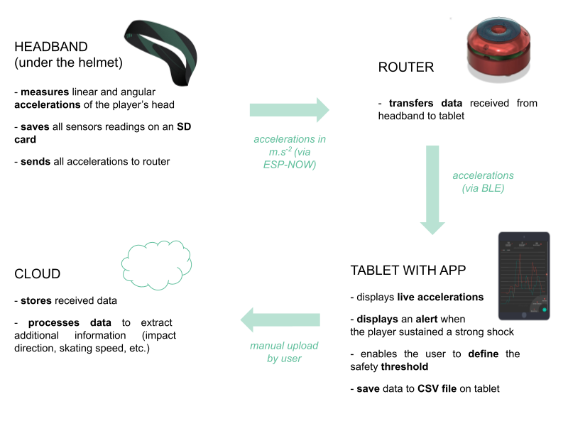
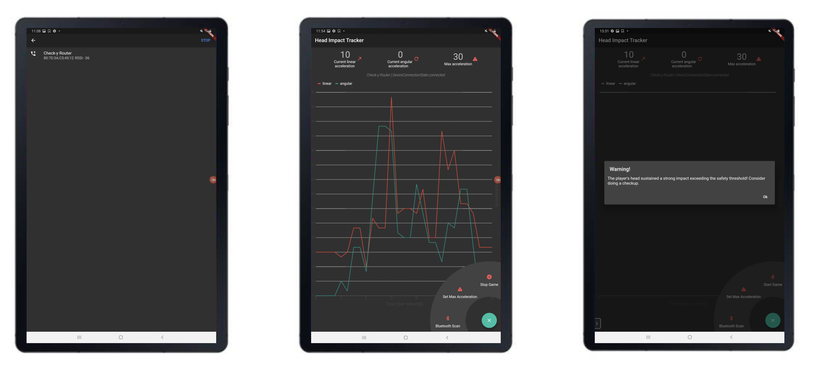

# Check-y

This project was completed as part of the Chinese Hardware Innovation Camp (CHIC) program, a Master's minor at the Swiss Federal Institute of Technologly in Lausanne (EPFL), Switzerland.

## Table of Contents

* [Description](#description)
* [App screenshots](#app-screenshots)
* [Tech/frameworks used](#tech/frameworks-used)
* [Hardware needed](#hardware-needed)
* [Setup](#setup)
* [How to use our device](#how-to-use-our-device)
* [Sources](#sources)
* [Authors](#authors)
* [License](#license)

## Description 

The main goal of this device is to **detect large head impacts** **sustained by athletes**. An **alert** is displayed by the **app** when the acceleration is considered dangerous and may require an examination of the player.

The project can be broken down into **4 modules**. The features detailed in the schematic below have all been successfully implemented.

## App screenshots

Through the app, the user can:

- [x] **connect** to the router (via BlueTooth)
- [x] receive data from a headband (via the router)
- [x] read **live linear & angular accelerations** 
- [x] plot these accelerations during a chosen time period
- [x] define his / her **safety threshold**
- [x] receive an **alert** when the acceleration exceeds the defined threshold
- [x] **download** the received **data** as a CSV file

## Tech/frameworks used

To develop this product, we used:

- the [Arduino](https://www.arduino.cc/) IDE to code the firmware in **C++**
- the [Flutter](https://flutter.dev/?gclid=Cj0KCQiAvbiBBhD-ARIsAGM48bxFAGzs3gWAGN6dBFMqM3unjVbl-PyLLc8HqQ3UjYQjHzmKjB7pjHkaAgyKEALw_wcB&gclsrc=aw.ds) framework to develop a cross-platform app
- [EasyEDA](https://easyeda.com/fr) to design our custom PCB for the headband
- [Django](https://www.djangoproject.com/) and **Python** to build our mySQL database and [Bootstrap](https://getbootstrap.com/) for the database frontend
- [Google Cloud](https://cloud.google.com/) to migrate ou database online 

## Hardware needed

- an **ESP32** board (e.g., a DO IT ESP32 DEVKIT V1 board) for the router
- our **custom PCB** for the headband (cf. the "Hardware" folder )
- a **tablet** or smartphone to run the Flutter app (⚠️ the app has only been tested on Android)

## Setup

In order to execute and upload properly the firmware to a router or a headband, you must first
make sure that the Arduino IDE has been correctly setup:

1. install the [Arduino IDE](https://www.arduino.cc/en/software)
2. install the **ESP32 board module** ([procedure](https://randomnerdtutorials.com/installing-the-esp32-board-in-arduino-ide-windows-instructions/))
3. for the router, choose Tools > Board > ESP32 Arduino > WEMOS LOLIN32 (important
   to be able to change the “Partition Scheme” (also in Tools) to “No OTA (Large APP)”
4. for the router, choose Tools > Board > ESP32 Arduino > DO IT ESP32 DEVKIT V1
5. ⚠️ add our two **custom libraries** (Adafruit LIS331 & Bolder Flight Systems BMI088 in the Firmware > "Custom Libraries" folder) using Arduino > Sketch > Include Library > Add .ZIP Library
6. add the “Adafruit BusIO” and “Adafruit Unified Sensor” libraries using Arduino > Tools > Manage Libraries

Once the Arduino IDE is correctly setup:

1. load the **headband firmware** onto our **custom PCB**
2. place the PCB inside the headband
3. load the **router firmware** onto an **ESP32 board** (we used a DO IT ESP32 DEVKIT V1 board)
4. download the **app** on a **tablet** / smartphone

## How to use our device 

To send the measured accelerations from the headband to the tablet:

1. **turn on** the **router** (press the button once)
2. wait a second
3. **turn on** the headband (using the switch)
4. open the app on the tablet
5. click on the expandable menu at the bottom right of the app
6. click on "**Bluetooth scan**"
7. a new window should have opened displaying the detected BLE devices → select "**Check-y router**"

After approximately 7 seconds, the live accelerations should be displayed on the app.

## Sources 

We used Chase Strickler's hear rate app ([GitHub](https://github.com/strcklr/DDish-Coding-Challenge/tree/5ae8deb23e88ea74f1a3f7b782157082140903fa/heartrateapp)) as a starting point for our own app. 

## Authors

🧑🏻‍🏭 **Taavet Kangur** (in charge of the hardware development)  
👩🏼‍💻 **Diane Marquette** (in charge of the firmware and app development)  
🧑🏾‍💻 **Maëlick Brochut** (in charge of the signal processing and back-end)  
👩🏻‍🎨 **Marine Fondin** (in charge of the headband design) 

## License

